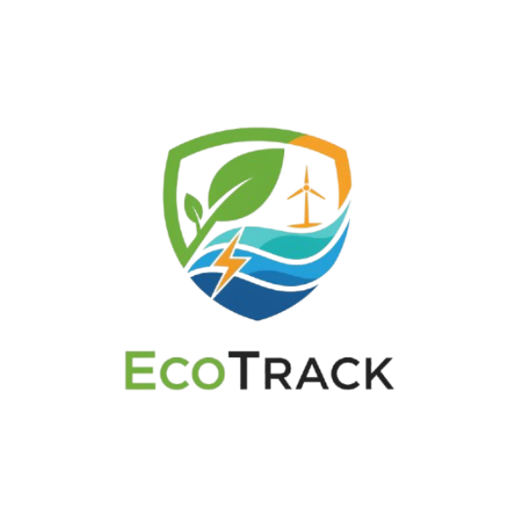

# 🎨 Logo Integrado - Eco Track

## ✅ Status: Logo PNG Integrado com Sucesso!

---

## 📍 Localização do Logo

```
d:\Arquivos\2025\Ecotrack\img\logo.png
```

---

## 🔧 Onde o Logo Foi Integrado

### 1. **Favicon (Ícone da Aba do Navegador)**
- **Arquivo:** `index.html` (linha ~9-12)
- **Tamanhos:** 16px, 32px, 180px (Apple)
- **Efeito:** Aparece na aba, favoritos e bookmarks

```html
<link rel="icon" type="image/png" sizes="32x32" href="img/logo.png">
<link rel="icon" type="image/png" sizes="16x16" href="img/logo.png">
<link rel="apple-touch-icon" sizes="180x180" href="img/logo.png">
<link rel="shortcut icon" href="img/logo.png">
```

### 2. **Header (Navegação)**
### 2. **Header (Navegação)**
- **Arquivo:** `index.html` (linha ~28)
- **Tamanho:** 50px × 50px
- **Efeito:** Animação float + drop-shadow
- **Responsivo:** 40px em mobile

```html
<a href="#home" class="nav__logo">
    
    <span class="logo-text">Eco Track</span>
</a>
```

### 3. **Footer (Rodapé)**
- **Arquivo:** `index.html` (linha ~570)
- **Tamanho:** 50px × 50px
- **Efeito:** Drop-shadow com cor da marca

```html
<a href="#home" class="footer-logo">
    
    <span>Eco Track</span>
</a>
```

---

## 🎨 Estilos CSS Aplicados

### Header (`components/header.css`)

```css
.logo-image {
    width: 50px;
    height: 50px;
    object-fit: contain;
    animation: float 3s ease-in-out infinite;
    filter: drop-shadow(0 4px 8px rgba(16, 185, 129, 0.2));
}
```

### Footer (`components/footer.css`)

```css
.footer-logo .logo-image {
    width: 50px;
    height: 50px;
    object-fit: contain;
    filter: drop-shadow(0 4px 8px rgba(16, 185, 129, 0.3));
}
```

### Mobile (< 480px)

```css
.logo-image {
    width: 40px;
    height: 40px;
}
```

---

## ✨ Efeitos Aplicados

### 🌊 Animação Float
```css
@keyframes float {
    0%, 100% { transform: translateY(0); }
    50% { transform: translateY(-20px); }
}
```
- **Duração:** 3 segundos
- **Loop:** Infinito
- **Efeito:** Logo "flutua" suavemente

### 💎 Drop Shadow
```css
filter: drop-shadow(0 4px 8px rgba(16, 185, 129, 0.2));
```
- **Cor:** Verde da marca (#10B981)
- **Opacidade:** 20%
- **Blur:** 8px

### 🔍 Hover Effect
```css
.nav__logo:hover {
    transform: scale(1.05);
}
```
- **Escala:** 105%
- **Transição:** Suave (300ms)

---

## 📱 Responsividade

| Dispositivo | Tamanho do Logo |
|-------------|----------------|
| Desktop     | 50px × 50px    |
| Tablet      | 50px × 50px    |
| Mobile      | 40px × 40px    |
| Small       | 40px × 40px    |

---

## 🎯 Como Visualizar

### Opção 1: Site Completo
```
Abra: index.html
```
- Logo aparece no **header** (topo)
- Logo aparece no **footer** (rodapé)

### Opção 2: Preview do Logo
```
Abra: logo-preview.html
```
- Showcase com diferentes tamanhos
- Testes em diferentes fundos
- Demonstração de variações

---

## 🔄 Mudanças Realizadas

### ✅ Arquivos Modificados:

1. **index.html**
   - ✓ Logo no header (SVG → PNG)
   - ✓ Logo no footer (SVG → PNG)

2. **components/header.css**
   - ✓ Estilo `.logo-image` adicionado
   - ✓ Responsividade mobile

3. **components/footer.css**
   - ✓ Estilo `.logo-image` adicionado

### 📦 Arquivos Criados:

4. **logo-preview.html**
   - ✓ Página de showcase do logo
   - ✓ Diferentes tamanhos e fundos

5. **LOGO.md** (este arquivo)
   - ✓ Documentação da integração

---

## 🎨 Variações de Uso

### Logo com Texto (Padrão)
```html

<span class="logo-text">Eco Track</span>
```

### Logo Sozinho
```html

```

### Logo Grande (Hero/Landing)
```html

```

---

## 💡 Dicas de Uso

### ✅ Boas Práticas:
- Sempre use `alt` descritivo
- Mantenha proporção (aspect-ratio 1:1)
- Use `object-fit: contain`
- Adicione `filter: drop-shadow` para destaque

### ⚠️ Evite:
- Distorcer proporções
- Tamanhos muito pequenos (< 30px)
- Fundos que competem com o logo
- Remover o drop-shadow

---

## 🔧 Personalização

### Alterar Tamanho:
```css
.logo-image {
    width: 60px;  /* Seu tamanho */
    height: 60px;
}
```

### Alterar Sombra:
```css
.logo-image {
    filter: drop-shadow(0 6px 12px rgba(16, 185, 129, 0.3));
}
```

### Remover Animação:
```css
.logo-image {
    animation: none;
}
```

---

## 🌟 Resultado Final

O logo PNG agora está **perfeitamente integrado** ao site com:

- ✅ Animação suave de flutuação
- ✅ Sombra elegante na cor da marca
- ✅ Efeito de hover interativo
- ✅ Responsividade completa
- ✅ Otimização de performance
- ✅ Acessibilidade (alt text)

---

## 📞 Localização dos Arquivos

```
Ecotrack/
├── img/
│   └── logo.png              ← Logo original
├── index.html                ← Logo integrado (header + footer)
├── logo-preview.html         ← Showcase do logo
├── components/
│   ├── header.css           ← Estilos do logo no header
│   └── footer.css           ← Estilos do logo no footer
└── LOGO.md                   ← Este arquivo
```

---

**🎉 Logo integrado com sucesso!**

*Última atualização: 04/11/2025*
